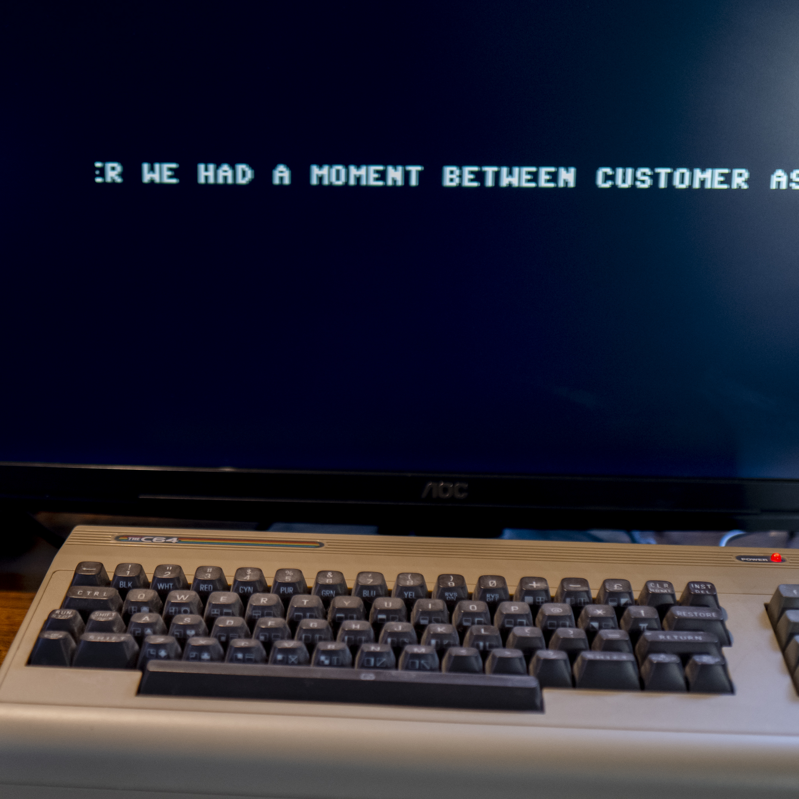

# Happy Chap 2017

Back in 2017, Roger Johansson and I decided to put together a Commodore 64 demo, just for fun. Klas Dahlen [had brought his computer to work](https://www.winsoft.se/2017/02/tva-nya-sid-latar/), and we squeezed in some [machine code programming](https://www.instagram.com/p/BB9v4GSzdoj/) whenever we had a moment between customer assignments at Nethouse. We never ended up releasing anything, but this is the SID tune I wrote for the project.

## Resources

- [The C64 program file](https://github.com/Anders-H/Happy-Chap-2017-/raw/refs/heads/main/happychap.prg)
- [A D64 disk image](https://github.com/Anders-H/Happy-Chap-2017-/raw/refs/heads/main/happychapdisk.d64)
